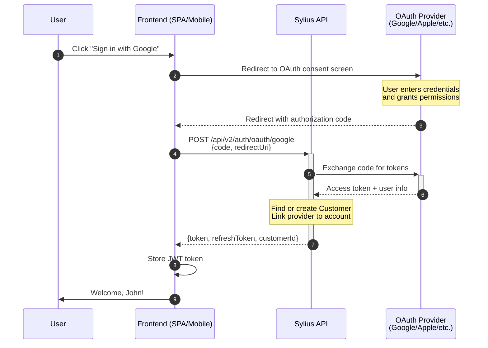
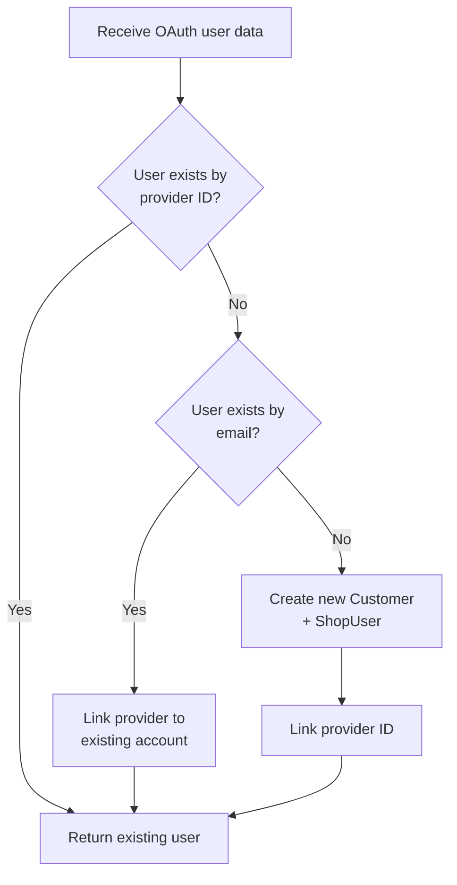
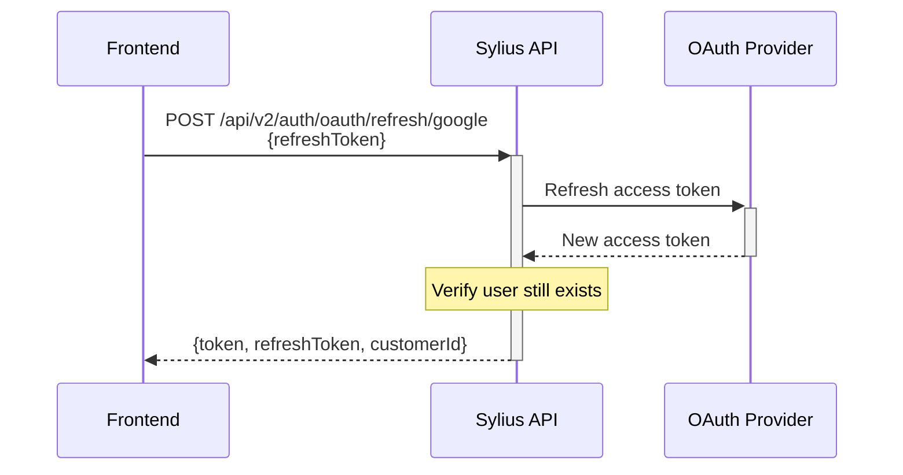
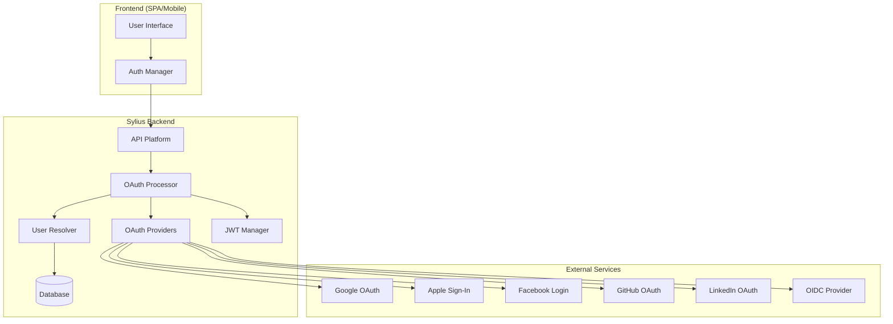

# OAuth Authentication Flow

This document explains how the OAuth authentication flow works with this bundle.

## Overview

The bundle implements a **headless OAuth flow** designed for SPAs and mobile apps. Unlike traditional server-side OAuth, the authorization code exchange happens via API, allowing your frontend to remain in control of the user experience.

## Sequence Diagram



## Detailed Flow Explanation

### Step 1-2: Initiate OAuth

Your frontend redirects the user to the OAuth provider's consent screen:

```javascript
// Example: Google OAuth redirect
const googleAuthUrl = new URL('https://accounts.google.com/o/oauth2/v2/auth');
googleAuthUrl.searchParams.set('client_id', 'YOUR_GOOGLE_CLIENT_ID');
googleAuthUrl.searchParams.set('redirect_uri', 'https://your-app.com/oauth/callback');
googleAuthUrl.searchParams.set('response_type', 'code');
googleAuthUrl.searchParams.set('scope', 'openid email profile');
googleAuthUrl.searchParams.set('state', generateCsrfToken()); // CSRF protection

window.location.href = googleAuthUrl.toString();
```

### Step 3-4: User Authorizes

The user sees the provider's consent screen, enters credentials, and grants permissions. The provider then redirects back to your frontend with an authorization code.

### Step 5-8: Code Exchange

Your frontend sends the authorization code to the Sylius API:

```javascript
// Handle OAuth callback
const urlParams = new URLSearchParams(window.location.search);
const code = urlParams.get('code');
const state = urlParams.get('state');

// Verify CSRF state matches
if (state !== storedCsrfToken) {
    throw new Error('Invalid state parameter');
}

// Exchange code for JWT
const response = await fetch('/api/v2/auth/oauth/google', {
    method: 'POST',
    headers: { 'Content-Type': 'application/json' },
    body: JSON.stringify({
        code: code,
        redirectUri: 'https://your-app.com/oauth/callback',
        state: state
    })
});

const { token, refreshToken, customerId } = await response.json();
```

### Step 9-11: Use JWT Token

Store the JWT token and use it for subsequent API requests:

```javascript
// Store tokens
localStorage.setItem('jwt_token', token);
localStorage.setItem('refresh_token', refreshToken);

// Use in API requests
const ordersResponse = await fetch('/api/v2/shop/orders', {
    headers: {
        'Authorization': `Bearer ${token}`,
        'Content-Type': 'application/json'
    }
});
```

## User Resolution Flow

When a user authenticates, the bundle resolves their identity:



## Token Refresh Flow

When the JWT token expires, use the refresh token:



```javascript
// Refresh expired token
const response = await fetch('/api/v2/auth/oauth/refresh/google', {
    method: 'POST',
    headers: { 'Content-Type': 'application/json' },
    body: JSON.stringify({
        refreshToken: localStorage.getItem('refresh_token')
    })
});

const { token, refreshToken: newRefreshToken } = await response.json();
localStorage.setItem('jwt_token', token);
localStorage.setItem('refresh_token', newRefreshToken);
```

## Architecture Diagram



## Security Considerations

### CSRF Protection (State Parameter)

Always use the `state` parameter to prevent CSRF attacks:

```javascript
// Generate state before redirect
const state = crypto.randomUUID();
sessionStorage.setItem('oauth_state', state);

// Include in OAuth redirect
googleAuthUrl.searchParams.set('state', state);

// Verify after callback
const returnedState = urlParams.get('state');
const storedState = sessionStorage.getItem('oauth_state');
if (returnedState !== storedState) {
    throw new Error('State mismatch - possible CSRF attack');
}
```

### Redirect URI Validation

The bundle validates redirect URIs against a whitelist. Configure allowed URIs in production:

```yaml
# config/packages/sylius_headless_oauth.yaml
sylius_headless_oauth:
    security:
        allowed_redirect_uris:
            - 'https://your-app.com/oauth/callback'
            - 'https://staging.your-app.com/oauth/callback'
```

### JWT Token Storage

For maximum security in browsers:

- **Access tokens**: Store in memory (JavaScript variable)
- **Refresh tokens**: Store in `httpOnly` cookie or secure storage

```javascript
// More secure approach: keep token in memory
let accessToken = null;

async function authenticate(code) {
    const response = await fetch('/api/v2/auth/oauth/google', {
        method: 'POST',
        body: JSON.stringify({ code, redirectUri: '...' }),
        credentials: 'include' // For refresh token cookie
    });
    const data = await response.json();
    accessToken = data.token; // Keep in memory, not localStorage
}
```

## Provider-Specific Notes

| Provider | Refresh Tokens | Notes |
|----------|----------------|-------|
| Google | Yes | Standard OAuth 2.0 |
| Apple | Yes | May rotate on each use; only sends name on first auth |
| Facebook | Limited | Short-lived tokens, can exchange for long-lived |
| GitHub | No | Access tokens don't expire |
| LinkedIn | Yes | Standard OAuth 2.0 |
| OIDC | Varies | Depends on provider configuration |
